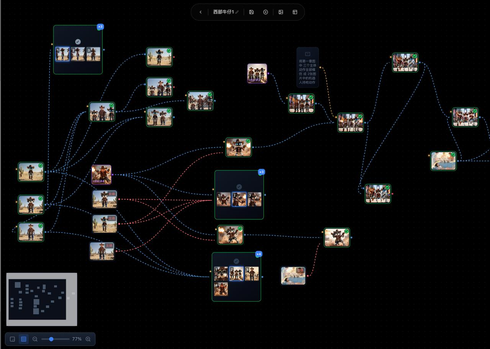

# 🎬 VideoFlow

> **ComfyUI for Video** — Node-based AI video creation engine

VideoFlow is a node-canvas AI video creation platform that lets you compose multiple AI models (Kling, Seedance, etc.) into visual workflows.

[English](./README.md) | [简体中文](./README.zh-CN.md)



## ✨ Features

- **Node Canvas** — ComfyUI-style visual workflow editor: drag nodes, connect ports, compose capabilities
- **Multi-Model Adapters** — Unified interface for Kling AI, Volcengine Seedance, and more. Implement one adapter, use it everywhere
- **DAG Execution Engine** — Topological sort + layered parallel execution + automatic port data flow
- **Dual Mode** — Agent chat mode (beginner-friendly) + Professional node canvas (precise control)
- **Real-time Feedback** — SSE streaming for execution progress, instant results on node completion
- **Media Management** — Local/S3 dual storage backend, auto-download, proxy delivery with auth

## 🏗️ Architecture

```
┌──────────────────────────────────────────────────┐
│                  Frontend (Nuxt 3)                 │
│   Vue Flow Canvas │ Tailwind CSS │ SSE Streaming    │
└────────────────────┬─────────────────────────────┘
                     │ REST + SSE
┌────────────────────┴─────────────────────────────┐
│                Backend (Spring Boot)               │
│  ┌──────────┐  ┌──────────┐  ┌────────────────┐   │
│  │Flow Engine│  │Adapters  │  │Media System     │   │
│  │DAG Topo  │  │Registry  │  │Local+S3 Storage │   │
│  │Port Flow │  │9+ skills │  │Proxy Download   │   │
│  └──────────┘  └──────────┘  └────────────────┘   │
└────────────────────┬─────────────────────────────┘
                     │
        ┌────────────┼────────────┐
        ▼            ▼            ▼
   Kling AI    Volcengine      PostgreSQL
              Seedance        + Flyway
```

## 🚀 Quick Start

### Prerequisites

- Docker & Docker Compose (recommended)
- Or: JDK 17+, Node.js 20+, PostgreSQL 16+, pnpm

### Option 1: Docker Compose (One Command)

```bash
# 1. Clone
git clone https://github.com/xuyaoZou/videoflow.git
cd videoflow

# 2. Configure environment
cp .env.example .env
# Edit .env, fill in your API keys (at least one model)

# 3. Launch
docker compose up -d

# 4. Access
# Frontend: http://localhost:3000
# Backend API: http://localhost:8090
```

### Option 2: Local Development

```bash
# 1. Start PostgreSQL
docker run -d --name videoflow-pg \
  -e POSTGRES_DB=luciano \
  -e POSTGRES_USER=luciano \
  -e POSTGRES_PASSWORD=*** \
  -p 5432:5432 \
  postgres:16-alpine

# 2. Start backend
cd luciano_backend
cp .env.adapters.example .env.adapters
# Edit .env.adapters, fill in API keys
mvn spring-boot:run

# 3. Start frontend
cd ../luciano-web
pnpm install
pnpm dev
```

### API Keys

| Model | Where to Apply | Notes |
|-------|---------------|-------|
| Kling AI | https://klingai.kuaishou.com/ | China: api-beijing.klingai.com |
| Volcengine Seedance | https://www.volcengine.com/product/ark | Bearer token auth |

## 🧩 Core Concepts

### Node Canvas

Each capability (text-to-video, image-to-video, text-to-image, etc.) is a node. Nodes connect via **ports**, and data flows automatically.

```
[Text Input] ──prompt──→ [Text-to-Image] ──image──→ [Image-to-Video] ──video──→ [Preview]
```

### Adapter Layer

Implement the `ModelAdapter` interface, register with `@Component`. Adding a new model is as simple as:

```java
@Component
public class YourAdapter implements ModelAdapter {
    // Implement submit/poll/download methods
}
```

### Port Type System

15 PortTypes with compatibility checking and automatic conversion (e.g., IMAGE → REFERENCE).

## 📊 Supported Capabilities

| Capability | Kling | Seedance |
|-----------|:-----:|:--------:|
| Text-to-Video (T2V) | ✅ | ✅ |
| Image-to-Video (I2V) | ✅ | ✅ |
| Video Extension (V2V) | ✅ | ✅ |
| Camera Control | ✅ | ✅ |
| Text-to-Image (T2I) | ✅ | ✅ |
| Image Edit (I2I) | ✅ | — |
| Background Removal | ✅ | — |
| Omni Model | ✅ | — |

## 📁 Project Structure

```
videoflow/
├── luciano_backend/          # Spring Boot backend
│   ├── src/main/java/com/luciano/
│   │   ├── adapter/          # Multi-model adapter layer
│   │   │   ├── kling/        # Kling AI adapter
│   │   │   └── seedance/     # Volcengine Seedance adapter
│   │   ├── flow/             # Flow engine (DAG + port system)
│   │   ├── controller/       # REST API
│   │   ├── service/          # Business logic
│   │   └── config/           # Config (Security, JWT, S3)
│   └── src/main/resources/
│       ├── db/migration/    # Flyway migrations (V1-V17)
│       └── application.yml  # Config (env-driven)
│
├── luciano-web/              # Nuxt 3 frontend
│   ├── components/
│   │   └── flow/             # Vue Flow canvas components
│   ├── composables/          # useAuth, useMediaLoader, useTheme, etc.
│   └── pages/
│
└── docker-compose.yml        # One-command launch
```

## ⚠️ Current Status

**Work in Progress** — Core framework is complete, actively iterating.

### Completed
- ✅ Adapter layer architecture + Kling/Seedance adapters
- ✅ Flow engine (DAG topology + port system + data flow)
- ✅ Vue Flow node canvas (dark theme + context menu + property panel)
- ✅ Workflow persistence (save/load/execute)
- ✅ SSE real-time execution feedback
- ✅ Media system (local/S3 storage + proxy download)
- ✅ JWT authentication
- ✅ Agent chat mode

### In Progress
- 🔄 E2E data flow validation
- 🔄 Workflow template system
- 🔄 Execution result persistence & restoration

### Planned
- 🔲 More model adapters (Runway, Pika, etc.)
- 🔲 TTS / audio generation
- 🔲 Multi-character consistency
- 🔲 Template marketplace

## 🛠️ Tech Stack

**Backend**: Java 17 · Spring Boot 3.3 · MyBatis-Plus · PostgreSQL · Flyway
**Frontend**: Nuxt 3 · Vue 3.5 · Vue Flow · Tailwind CSS
**Storage**: Local filesystem · S3-compatible (TOS/MinIO/AWS)
**AI Models**: Kling AI · Volcengine Seedance

## 📝 License

MIT License — Use freely, PRs welcome.

## 🙋 About

A solo-built AI video workflow engine. If you're working on AI video, let's connect.

Issues / PRs / Stars are all welcome.